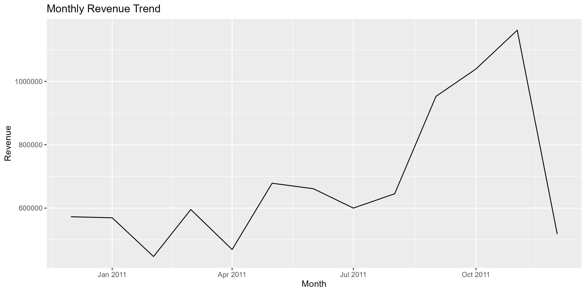
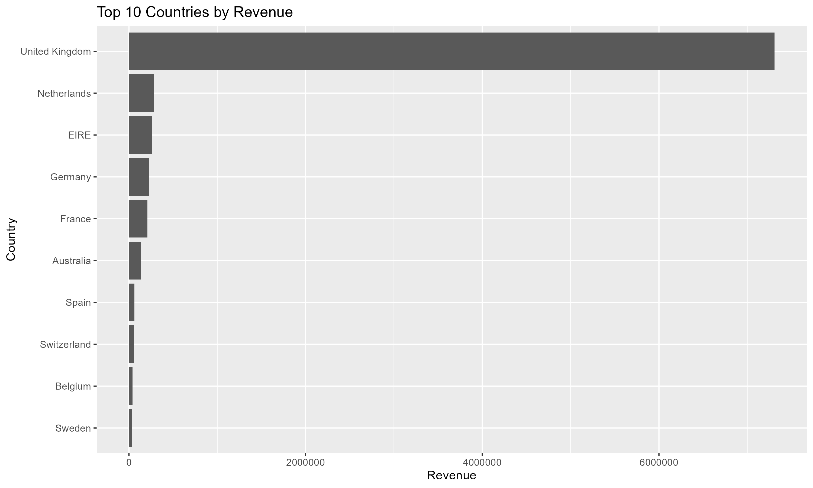
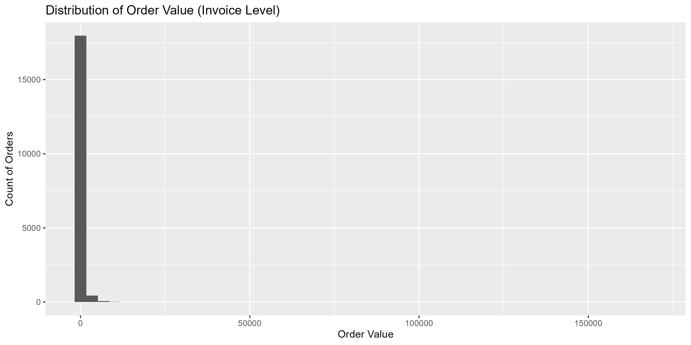
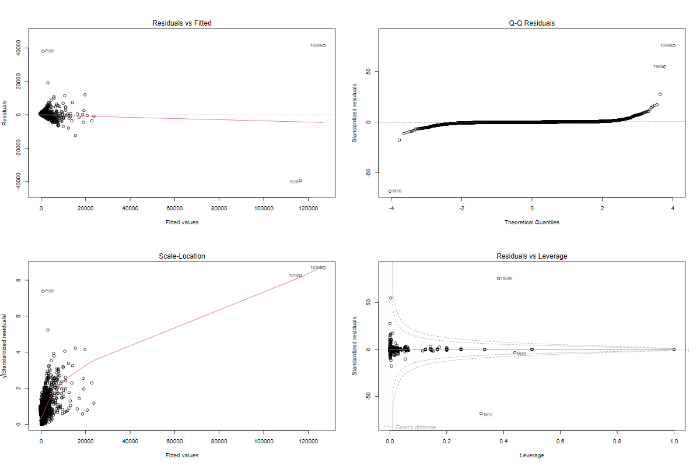
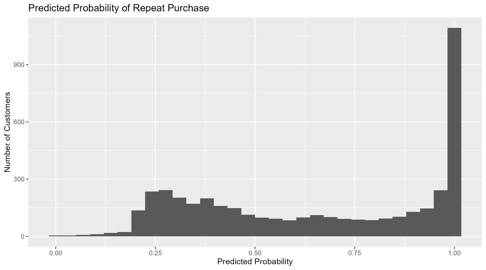
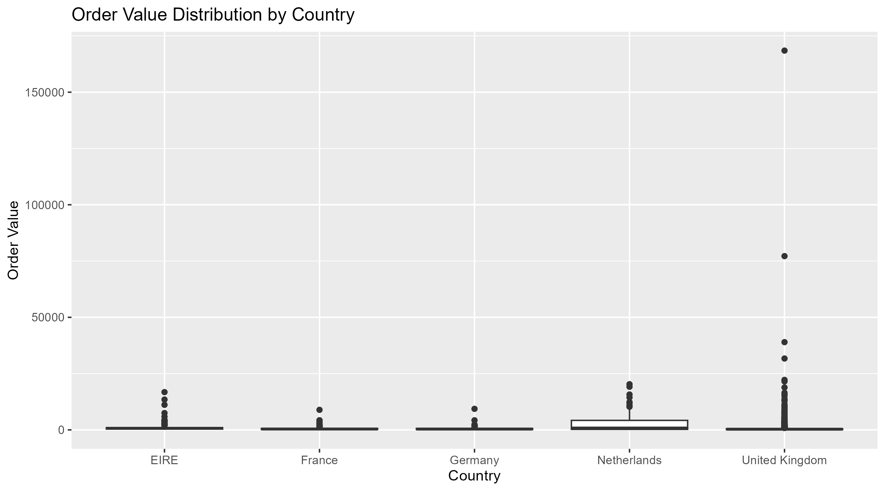

# Revenue Optimization & Customer Behavior Analytics using R

## Overview
This project analyzes transactional e-commerce data to understand customer purchasing behavior and identify drivers of revenue generation. Using statistical analysis techniques and R-based data workflows, the project evaluates order value patterns, geographic differences in customer spending, and predictors of repeat purchasing behavior.

The analysis demonstrates how statistical methods can be applied to real-world business data to support decision-making.

---

## Dataset

The project uses the **Online Retail II dataset** (https://archive.ics.uci.edu/dataset/502/online+retail+ii) from the UCI Machine Learning Repository.

Dataset characteristics:

• ~1 million transactions  
• UK-based online retail company  
• Customers from multiple countries  
• Transaction period: 2009–2011  

Key variables:

| Variable    | Description                |
| ----------- | -------------------------- |
| Invoice     | Transaction identifier     |
| StockCode   | Product identifier         |
| Description | Product name               |
| Quantity    | Number of units purchased  |
| InvoiceDate | Transaction timestamp      |
| Price       | Unit price                 |
| CustomerID  | Unique customer identifier |
| Country     | Customer location          |

---

## Business Questions

This project addresses several business questions:

1. What are the key revenue and customer activity metrics?
2. What is the expected average order value and its statistical confidence interval?
3. Do customers from different regions exhibit different purchasing behavior?
4. What factors influence order value?
5. What characteristics are associated with repeat purchasing customers?

---

## Analytical Workflow

The project follows a typical data analytics pipeline:

### 1 Data Cleaning & Feature Engineering
- Removed cancelled transactions
- Filtered missing customer IDs
- Created revenue and time-based features

### 2 Exploratory Data Analysis
- Monthly revenue trends
- Order value distribution
- Top countries and products by revenue

### 3 Confidence Interval Estimation
Estimated the true average order value using 95% confidence intervals.

### 4 Hypothesis Testing
Tested whether spending behavior differs between UK and international customers.

### 5 Regression Analysis
Identified key drivers influencing order value.

### 6 Logistic Regression
Modeled the probability that a customer becomes a repeat buyer.

### 7 ANOVA
Evaluated whether order value differs significantly across countries.

---

## Key Insights

Key findings from the analysis include:
- The average order value falls within a statistically estimated range based on confidence interval analysis.
- Hypothesis testing shows significant differences in purchasing behavior between UK and international customers.
- Regression analysis indicates that order size and product price significantly influence order value.
- Logistic regression identifies revenue and purchasing patterns as predictors of repeat customer behavior.
- ANOVA results suggest that average order values differ across major customer countries.
These insights demonstrate how statistical methods can be used to evaluate business questions using transactional data.

---

## Visualizations

### Monthly Revenue Trend

### Top 10 Countries by Renvenue

### Order Value Distribution

### Regression Diagnostic

### Predicted Probability of Repeat Purchase

### Country Comparison (ANOVA)

---

## Tools & Technologies

This project was implemented using:

• R  
• tidyverse  
• dplyr  
• ggplot2  
• lubridate  
• broom  
• Git  
• GitHub  

---

## Project Structure
Revenue-Optimization-Analytics
│
├── data
│   └── processed
│
├── scripts
│   ├── 01_data_cleaning.R
│   ├── 02_eda_descriptive.R
│   ├── 03_confidence_intervals.R
│   ├── 04_hypothesis_testing.R
│   ├── 05_regression_analysis.R
│   ├── 06_logistic_regression.R
│   └── 07_anova_analysis.R
│
├── outputs
│   ├── tables
│   └── figures
│
├── business_problem.md
├── kpi_dictionary.md
└── README.md

---

## How to Run the Project

Clone the repository

git clone https://github.com/Onisha8/Revenue-Optimization-Analytics

Install required R packages

install.packages(c("tidyverse","lubridate","broom","janitor"))

Run scripts in order:

scripts/01_data_cleaning.R  
scripts/02_eda_descriptive.R  
scripts/03_confidence_intervals.R  
scripts/04_hypothesis_testing.R  
scripts/05_regression_analysis.R  
scripts/06_logistic_regression.R  
scripts/07_anova_analysis.R  

---

## Skills Demonstrated

• Data cleaning and preprocessing  
• Exploratory data analysis  
• Inferential statistics  
• Hypothesis testing  
• Regression modeling  
• Logistic regression  
• ANOVA  
• Data visualization  
• Reproducible analytics workflows  

---

## Author

**Onisha Gangwal**

Master’s Student – Artificial Intelligence & Business Analytics  
University of South Florida
